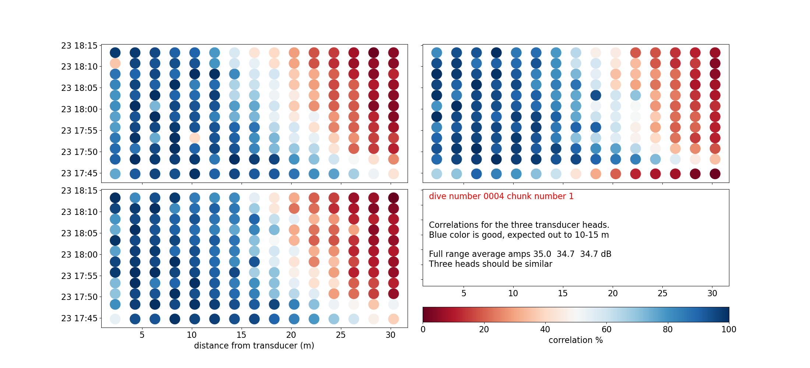
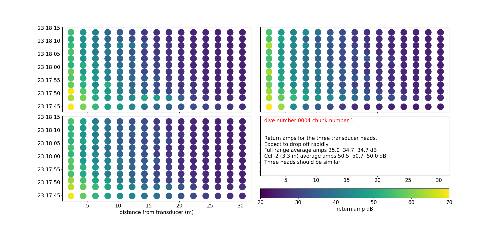
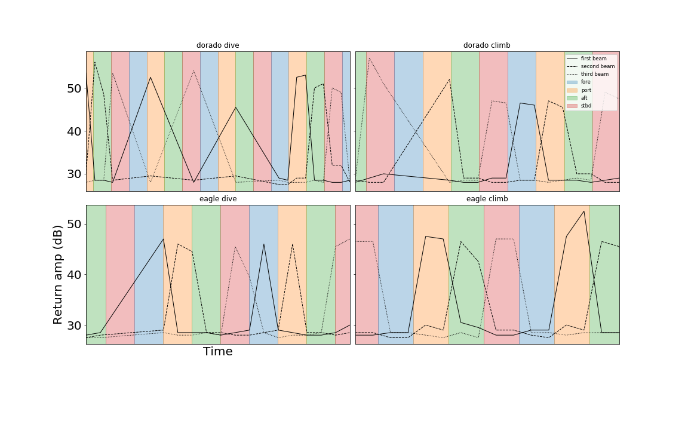

# Quick Start Guide Seaglider AD2CP

Last updated October 2020. For the most recent version and link to supporting software and documentation visit:

https://github.com/callumrollo/adcp-glider-guide

This informal guide was compiled using information from the Nortek Signature manuals, in particular the Integrator's Guide, correspondence with Nortek and Seaglider (now Hydroid, previously Kongsberg) support teams, published data from previous integrations on the Seaglider and Spray platforms, and personal experience working with the system 2018-2020. This guide comes with no warranty, guarantees of competence, or support. In following this guide you may irreparably damage your glider, sensor, computer, lab, person etc. The author assumes no responsibility. Please don't sue me, I'm poor.

For qualified and competent tech support contact:

support@nortekgroup.com

seaglidersupport@hydroid.com

### To start the AD2CP for bench testing you will need:

- **AD2CP  Signature Deployment and MIDAS software** 

https://www.nortekgroup.com/software (Windows only)

- **AD2CP manuals "Signature Operations" and "AD2CP Integrator's Guide"**

  https://www.nortekgroup.com/manuals-quick-guides

- **Powered ethernet to standard subsea 8 pin cable** (included in glider case)

The Nortek website is the authoritative source for all information regarding the AD2CP and should be checked for the latest software and manuals.

### Connect to the AD2CP

1. Ensure that both glider and ethernet cable are powered **off**. It is not necessary to disconnect the AD2CP to glider serial cable at the port marked "R"
2. Remove the dummy plug and connect the 8 pin cable to the starboard port of the AD2CP, the port is marked "E" for ethernet. **Note** the serial and ethernet ports on the glider AD2CP are the opposite way round to that shown in the Signature 1000 guide.
3. Connect the ethernet cable to your windows computer.
4. Connect the power supply and power the cable. The ethernet port on your computer should light up. The light on the AD2CP should turn on.
5. Open the Signature Deployment software and wait 1-2 minutes for the AD2CP to assign an IP address.
6. In Signature Deployment select menu option "Discover," you should see a line of data appear with the sensor highlighted in red. Right click this and select "view in browser" to see instrument information and download data files. Select "open in command mode" to control the instrument and conduct bench tests.

The Signature Deployment software expects sensors from the Signature range but has the capability to interact with the glider mounted AD2CP. Using this software it is possible to communicate with the AD2CP via a terminal emulator, download files from the AD2CP and start recording data. Data visualization/interpretation is not supported as of September 2020.

### Bench test the AD2CP

For ease of reading I have printed all commands in **BOLD UPPERCASE** the AD2CP itself is not case sensitive.

1. Open the command window as detailed above and send the following commands:
2. **INQ** to check the glider is in state 002 ready to receive commands. Otherwise see instrument states below.
3. **LISTFILES** to see what's already on the memory card.
4. **SETDEFAULT,ALL** a good place to start. This sets all AD2CP recording settings to their default values. No AD2CP data files will be affected.
5. **SETPLAN,FN="sensible_filename.ad2cp"** so you don't overwrite pre-existing files as the previous command sets default filename Data.ad2cp. Must use the .ad2cp file extension.
6. Change other variables as you see fit, there are some suggestions later in this guide.
7. **SAVE,ALL** to test if your configuration is possible with the instrument. If this returns **OK** you can deploy, otherwise **GETERROR** will tell you which settings are incompatible. It's a good idea to **SAVE,ALL** after each variable you change to save yourself more difficult changes in the event of an error.
8. **START** this will put the instrument in record mode. Leave it to collect data.
9. To finish recording, use the buttons "send break" and "switch to command mode" or send keyboard commands **CTRL-C**  then **MC** 

### Instrument modes

A schematic of the core states of the instrument and the commands to switch between them from the Integrator's Guide

Numerical codes for the AD2CP states from the Integrator's Guide. This is the number returned after sending the **INQ** command.

### A sample plan for a glider deployment, as used in tank testing

**SETDEFAULT,ALL **

**SETPLAN,FN="2018_09_05_TANKTEST1.AD2CP"** 

**SETPLAN,MIAVG=30** 

**SETAVG,AI=2 **

**SETAVG,NC=15 **

**SETAVG,CS=2.0, **

**SETAVG,NPING=8**

**START**

This will record a profile every 30 s averaging 8 pings over a two second period and recording 15 cells of 2 m size.

### Handy commands 

Commands for parameters typically have three key options "get" for the present setting "getlim" for the acceptable range of values and "set" to assign a new value to a parameter. To confuse things, parameters are grouped into a number of categories which must be stated when interrogating that parameter. e.g. to interrogate the cell size **CS** parameter for the average profile use: **GETAVG,CS** to find its present value **GETAVGLIM,CS** to find the accepted range of cell size values and **SETAVG,CS** to set a new value for cell size. Values such as file name are controlled through the group "**PLAN**" rather than "**AVG**"

General commands:

- **BBPWAKEUP** when connected to instrument so it will receive commands.
- **INQ** get glider state. Glider must be in mode 002 to receive other commands.
- **GETSTATE** for more detailed info than **INQ** regarding deployment time etc.
- **GETPLAN** for details on the deployment plan, including the filename for data.
- **GETPLAN1** for the alternate plan parameters (these parameters set to 0 by default).
- **GETALL** and **GETALLLIM** for most parameters and their ranges of accepted values.
- **GETPRECISION**/**GETPRECISION1** for precision in burst and avg mode (cm/s) for plan 0/plan 1.
- **RECSTAT** for recorder (memory card) information, free blocks etc.
- **LISTFILES** list all files on the memory card.
- **GETCLOCKSTR** to get the clock. This syncs from the glider clock on each dive.
- **SETTMAVG** for averaging of profiles. used for returning snippet files.
- **ERASE,9999** Wipe the recorder before deployment. This will also reset any plans loaded. Make sure you copied ALL the data you need before using this.

n.b. **GETALL** will return some errors as the custom glider AD2CP lacks some of the functionality of the Signature 1000 such as a vertical beam. Don't panic, your sensor is fine. 

### On data limit formats (values returned by "getlim" commands)

The limits for the various arguments are returned as a list of valid values, and/or ranges, enclosed in parenthesis (). An empty list, (), is used for arguments that are unused/not yet implemented. Square brackets [] signify a range of valid values that includes the listed values. String arguments are encapsulated with “”, like for normal parameter handling. A semicolon ; is used as separator between limits and values. The argument format can also be inferred from the limits, integer values are shown without a decimal point, floating point values are shown with a decimal point and strings are either shown with the string specifier, “”, or as a range of characters using ‘’ for specifying a character.
Examples:
[1;128] – Integer value, valid from 1 to 128.
([1300.00;1700.00];0.0) – Floating point value, valid values are 0.0 and the range from 1300.00 to 1700.00.
(['0';'9'];['a';'z'];['A';'Z'];'.') – String argument with valid characters being . and the character ranges a-z, A-Z, 0-9.
("BEAM") – String argument with BEAM being the only valid string.
(0;1) – Integer value with two valid values, 0 and 1.

### Clearing up confusion

- **SETPLAN,MIAVG** is the time period between successive average measurements. **SETAVG,AI** is the time interval over which the measurements are averaged. So setting setplan,miavg=20 and setavg,ai=5 will have the sensor measure for 5 seconds in every 20 and average data over each 5 second measurement interval.
- The .ad2cp files store all the variables that the AD2CP was set to during recording, so there is no need to record what commands you sent to the instrument.
- The AD2CP will only use 3 beams at once, you must set the vertical direction to avoid disappointment! The glider will do this automatically when performing (sim) dives, but for bench tests you must change it manually with **SETPLAN,VD**
- If a co-ordinate system other than **BEAM** is set (e.g. **XYZ**), the AD2CP will convert to this system at time of recording. This conversion is very difficult to undo and an error in the compass/tilt sensor could really mess with your data. Nortek recommend recording in BEAM mode and carrying out any coordinate transformations in post processing.

### Burst vs avg and the two plans

The AD2CP can run two average and burst plans concurrently so many parameters have four settings, **SETBURST** for burst mode in plan 0, **SETAVG** for average mode in plan 0 and **SETBURST1**, **SETAVG1** for the same parameters in plan 1. See the Integrator's guide for more detail.

### What to do if the AD2CP demands a password

The AD2CP occasionally requires a login, usually after being left powered on with no input. The details should be

Signature Username: nortek
Password:
(blank) 
or 
Signature Username: nortek
Password: nortek

If neither of these work, temporarily interrupting the power supply and restarting Signature Deployment will get you back in. This does stop the AD2CP from recording data. The password can be reset when connected via ethernet.

### Miscellaneous handy information

When connected to power, a steady blue light on the AD2CP indicates that it is drawing power and not actively recording.  When deployed, the light blinks when it sends out an acoustic ping, there is a quiet but audible click.

Tests shows the clock drifts at approx 1 sec/week. However the clock syncs with the Seaglider's clock at the start of every profile, so this should not be an issue.

The AD2CP has a 16GB memory card

The AD2CP does not have

- vertical beam
- bottom tracking
- pulse coherence
- onboard power

### Useful excerpts from the ADCP Integrator manual, last updated Oct 2017. Comments added in italics

"The AD2CP uses a two-processor (DSP) design; one dedicated to Doppler processing (BBP) and the other to Interface (SEC). The primary interface is Ethernet, so the Interface processor is only powered when external power is applied. Note that powering through the Ethernet cable will also power the rest of the electronics." *All you need to do to test the sensor is plug in the powered Ethernet cable* 

"In addition to the traditional serial port interface for real time data output there are several options for communication over Ethernet. The Ethernet communication is handled by a dedicated processor in the instrument. This network processor runs a Linux operating system, which makes it possible to connect to the instrument via telnet, raw connections and FTP." *I have not succeed with a raw telnet communication yet. Only with the dedicated Nortek terminal emulation. It should be possible though. This would be useful as Nortek software is MS Windows only* 

"The SETALTERNATE/GETALTERNATE command allows two different configurations to be run consecutively in time. The primary configuration (defined by SETPLAN, SETBURST, SETAVG, SETTMAVG, SETBT) is run for “PLAN” seconds, after which the unit powers down for a given period of time (“IDLE” seconds). The alternate configuration (defined by SETPLAN1, SETBURST1, SETAVG1, SETTMAVG1, SETBT1) is then run for “PLAN1” seconds and the unit powers down for “IDLE1” seconds. The configuration is then switched back to the primary and the process is repeated. The valid range for the various arguments should be verified using the GETALTERNATELIM command.  Note that the filename in setplan and setplan1 must be the same" *SETALTERNATE is potentially useful but quite confusing. Caution recommended if using this functionality*

### Controlling the AD2CP through the Seaglider

This requires three things:

1. Seaglider must be using the main.run variant called EAGLCP, this is a version of firmware 66.12 Eagleray. This firmware version solves some timing issues that Clownfish has with the AD2CP as well as an issue in Clownfish where the AD2CP was turning the wrong beams on and off during ascent and descent. For further details contact Hydroid.
2. The file ncp.cnf must be loaded to the glider memory card and stripped. This contains low level commands for the glider-AD2CP interface
3. The file NCP_GO must be present on the basestation and the settings stipulated in it MUST be valid for the AD2CP, i.e. the AD2CP does not return an error when you try to do a bench test with these settings. This file can be updated during a deployment to change the AD2CP settings.

Note: the NCP_GO file supplied by Elizabeth Creed in September 2018 is rejected by the glider with settmavg,cn="ENU" the coordinates must be "BEAM". This only affects the snippet files anyway.

To toggle the return of snippet files (approx 8Kb  per dive) in the cmdfile use the command $CP\_XMITPROFILE in the cmdfile. $CP\_XMITPROFILE,1 to turn on snippet files or $CP\_XMITPROFILE,0 to turn off.

##### Telemetry/snippet files

If telemetry is enabled, the glider will send back snippet files over Iridium. Once all the parts are collected two files will be generated for each dive cpNNNNau.r for the dive and cpNNNNbu.r for the climb, where NNNN is the four digit dive number. 

This data is then combined in pcp637NNNNa.dat

The telemetry files are chunked into repeating blocks of NMEA messages.

The first row of each block specifies the number of beams, instrument serial number, number of beams in use, number of cells, blanking distance, cell size and coordinate system of snippet file data.

`$PNORI1,4,100476,3,15,0.30,2.00,ENU*0F`

These NMEA strings consist of three parts:
1.  `$PNORI1` is the "talker". In this case `P` identifies a proprietary system `NOR` is the identifier for Nortek and `I1` is the Nortek code for this message string. 
2.  `4,100476,3,15,0.30,2.00,ENU` The comma separated values are the values of parameters specified by the manufacturer for this message type, identified by their position. Where data are not available, an empty space is left e.g.`4,100476,,,0.30,,ENU` such that position is not lost.
3. `*0F`is an optional checksum in hexadecimal, calculated by bitwise exclusive OR of the ASCII characters between the `$` and `*`

For more information on NMEA, see the pdf guide from the pynmea2 library https://github.com/Knio/pynmea2/blob/master/NMEA0183.pdf

The second row:

`$PNORS1,112318,113108,0,2A4C0002,13.8,1497.3,0.00,226.4,18.0,0.00,-1.5,0.00,63.305,0.00,11.83*7F`

Specifies more constants including sound speed and temperature.

After this there are multiple rows beginning $PNORC1, one for each sample taken.

`$PNORC1,112318,113108,1,2.3,0.083,0.113,-0.039,64.0,63.3,63.4,86,82,75*5D`

 The columns of this data following the talker string are as follows: date (mmddyy), time (hhmmss), cell number, cell distance from transducer, vel head 1, vel head2, vel head3, return amp head 1, return amp head 2, return amp head 3, correlation head 1, correlation head 2, correlation head 3. Distance in m, Speed in m/s, amplitude in dB, correlation in %.
 
The python script `tele_checker.py` reads these text files and plots the beam amplitude and correlation for each dive in groups of 10 ensembles. Each plot typically covers 40 -60 minutes of data. These plots are saved as in png format with file names `tele_amp_NNNN_X.png` and `tele_cor_NNNN_X.png` where NNNN is the dive number and X the chunk number. Examples from EUREC4A of good data:

**Snippet files correlations**: Good correlations are in blue, we expect good correlation out to 10 m at least. Range may be less in low scattering however. The first cell often has a lower correlation, possibly due to ringing.

**Snippet files amplitudes**: Amplitude drops off rapidly with distance, this is raw return amp not gain adjusted so this is expected. Check to make sure all three heads report similar return amps.

The script also produces average plots using all the snippet file data in the folder.

Call `tele_checker.py` from the terminal using `python telechecker.py -p 'path-to-your-adcp-snippet-files`. Make sure that the Python libraries required by the script are in your shell path. Snippet files can be processed automatically by adding this command to a glider's `.logout` file. The script checks for existing figures, so only new snippet files and average data are processed.

###### Further snippet files details

These settings for snippet files can be changed with **SETTMAVG** and the following arguments can be specified:

- **EN** Enable Averaging Mode Telemetry 1 to enable, 0 to disable
- **CD** Cells Divisor
- **PD** Packets Divisor
- **AVG** Average Telemetry Data
- **TV** Store Velocity
- **TA** Store Amplitude
- **TC** Store Correlation
- **CY** Coordinate System
- **FO** Enable File Output
- **SO** Enable Serial Output
- **DF** Data format **Do not change!**

----------------------

### Scientific guidance

Average mode is best for shear velocity information. Low power consumption and good data quality can be achieved using the settings suggested by Creed or Rudnick (see NCP_GO files included in repo). Burst mode is geared toward measurements of turbulence, this is more power hungry and will fill up the memory card faster.

During deployment, the glider should be kept within an attitude envelope that orients the three operating transducers at similar angles from the vertical. If the glider pitches or rolls outside of the envelope, the beams will sample water parcels at different depths. The AD2CP does not actively resample by changing time gating of data recording as some other ADCPs do.

This vertical beam miss can be calculated using functions in the adcp-glider repo. Here is an example of the attitude effects on vertical beam miss at 15 m from the glider.

-----------------

### Data analysis options

The free Nortek software **SignatureViewer** will display data and show you that the sensor is recording at the intervals you set. However, it does not process the three beams correctly as it expects four beam input. You can use SignatureViewer to export data files as ntk and then view them with another program.

**Nortek MIDAS** will read .adcp files and convert them to netCDF4, matlab or csv format. It will also convert to and replay ntk files.

Nortek's propietary **OceanContour** apparently can read the AD2CP data, but costs over £1000. The author has not tried it.

##### How to export the .ad2cp files for analysis

1. Open Nortek Midas
2. In the Data menu use the option "AD2CP to ntk" to convert your binary ad2cp file to a re-playable ntk.
3. In the same Data menu there are tools for exporting these ntk files to netCDF4, Matlab and ASCII format.
4. The netCDF4 files are open source standards that can be read into a number of programes with the netCDF4 library.

## Data analysis

All the following examples are excerpts from the repository

https://github.com/callumrollo/adcp-glider/

All code is published open source under GPLv3. Some of it is even documented and tested. Feel free to take it, remix and redistribute it.

The repo is built on Python functions and takes as input the netcdf files converted from .ad2cp files and optionally the netcdf from 

### Bench tests
 
 A number of bench tests are recommended before deploying the ADCP glider. Particularly after making any changes to the AD2CP or glider firmware.

#### Physically test transducers

Rationale: At least one Seaglider firmware version (66.12 Dorado) had an error that suplied the opposite orientation parameter to the AD2CP during dive and climb phases. This caused the incorrect beam to be switched off, though the AD2CP sent out pings and recorded data as normal. To test that the AD2CP is behaving as expected, I recommend you physically test the transducers during a sim dive.

This can be acomplished by the simple expedient of a water filled nitrile glove and a timing source. 

Be sure that your timing source matches the AD2CP. The simplest way to acomplish this is to conduct a sim dive after the glider has synced its clock to GPS and use a similarly synced source. +/1 a second is good enough.

1. Set the AD2CP up to record every 15 seconds (see example above) using the NCP_GO file on the basestation.
1. Start the glider on a sim dive to at lest 30 m, to ensure a long enough time series for recording.
1. Fill a nitrile glove with water and place it over each transducer head in turn, recording the timing of each placement. I suggest moving the glove every 30 seconds.
1. Once the sim dive is finished, turn off the glider and recover the data.
1. Plot the data up and compare to the timing of when each transducer was covered. Covering the transdcucer with a water filled glove significantly increases the return amplitude of the signal, in comparison to the other transducers that are firing in air. (See the example at [make this link to the notebook itself](https://github.com/callumrollo/adcp-glider/).
1. One transducer will not fire, check this is the correct one. For optimum data collection, the aft facing trasducer should be switched off during the dive, the fore facing transducer should be switched off during the climb.

Example result of the above procedure when used to test a firmware fix. Under the old Dorado firmware (top row) the fore facing beam was switched off during the dive and the aft facing beam was switched off during ascent, the oposite behaviour to what was desired. The issue was fixed with the Eaglecp firmware (bottom row).

### Tank tests

It is recommended to carry out the above tests in a tank prior to deploying the glider. Testing is a tank will test that the four transducers record a similar signal return in water. If ther signal return differs by more than a few decibels, this could be a sign of a damaged transducer. Due to the amount of acoustic ringing in a tank, the measurements of water velocity reported will not be reliable.
 
 
-----------------------------------
This guide is a work in progress. Please direct any questions/recommendations to Callum Rollo

 *firstnameinitial.lastname*@uea.ac.uk 
 
 *firstnameinitial.lastname*@outlook.com 
 
 Or submit an issue/pull request on Github

